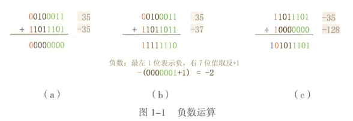

## 二进制

### 二进制的换算

| 1=1   | 10=2  | 100=4 | 1000=8 | 11000=24   |
| ----- | ----- | ----- | ------ | ---------- |
| 2^0=1 | 2^1=2 | 2^2=2 | 2^3=8  | 2^4+2^3=24 |

### 位数的物理表示

8条电路，每条电路有2种状态。总共能表示2^8=256种电路状态，范围为（0~255）。

而32位机器说的就是它有32条电路，能够同时处理字长为32位的电路信号（2^32-1=4294967295）

1条电线=1位（1bit），8bit = 1Byte，1024Byte = 1KB，1024KB = 1MB...

### 进制运算

第一位0表示正数，1表示负数

8条电路最大为127（即01111111），所以它能表示的范围是（-128~127）

#### 加减法

加减法都可以通过二进制的加法运算

  

