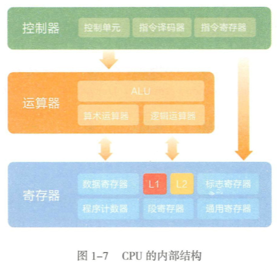

# CPU & 内存

## CPU的内部结构   

  

控制器的组成如下：

- 控制单元：CPU的大脑，由 时序控制 和 指令控制 组成
- 指令译码器：在控制单元的协调下完成指令读取、分析并交由**运算器**执行
- 指令寄存器：存储指令集（X86、SSE、MMX等）

控制器相当于编译器，从**指令寄存器**读取数据，运算后存回寄存器。

运算器从寄存器提取数据，（01字节）执行算术运算或逻辑运算，最后保存回寄存器。

## 内存   

内存的物理结构如下:

- 内存芯片：核心为存储单元   
- 电路板
- 控制芯片
- 相关支持模块：由地址编码器 + 读写控制器 组成

内存的速度 & CPU配合方式

  

存储单元都有十六进制的编号（32位机器由0x开头），C & C++可以直接操作内存地址，进行分配和释放。而Java则由JVM进行分配与释放，整个过程叫做垃圾回收机制。  

  

