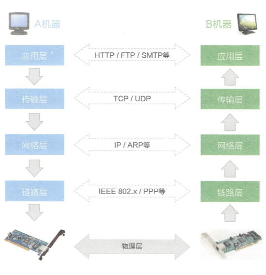
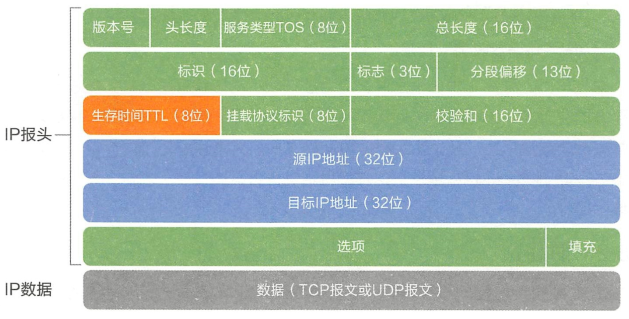
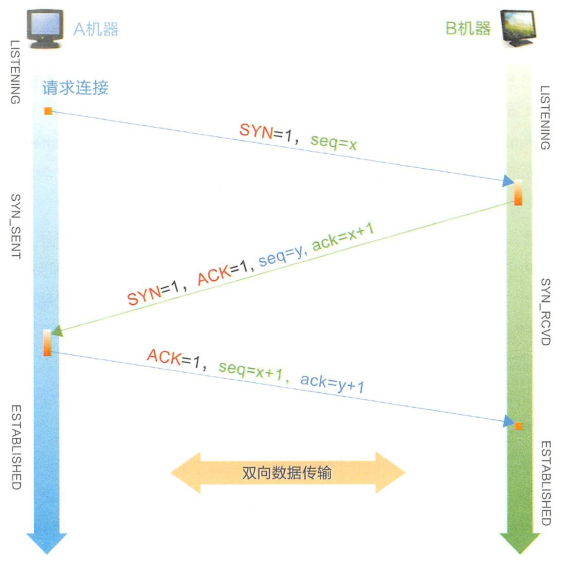
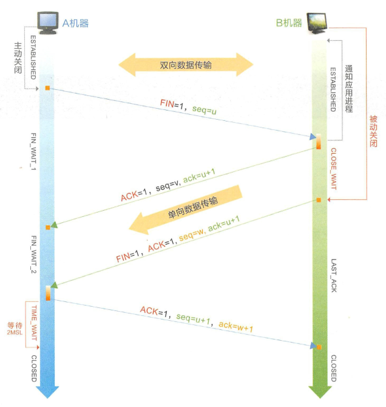

# TCP/IP

## 网络协议

多机之间的数据交流需要协议支撑（进行打包和解包）。协议的分层框架如下：

  

应用层按照协议打包数据，传输层加上双方端口号，网络层加上双方ip地址，链路层加上MAC地址、并将数据拆分成数据帧。经过路由和网关到达目标机器。

- 链路层：以字节为单位把0和1分组，加上源、目标机器物理地址、数据、校验位来传输数据。

  MAC地址为16进制，由管理机构分配+厂商分配

- 网络层：根据 IP 定义网络地址，区分网段。子网内根据地址解析协议（ ARP ) 进行 MAC 寻址， 子网外进行路由转发数据包，这个数据包即 IP 数据包。（？？？）  由于不同硬件对数据帧的最大长度（MTU）限制不同，所以路由器要对IP报文进行分片。

- 传输层：应用程序确认身份之后，将数据包交给其他应用程序。其使用断地是UDP和TCP协议。UDP是面向无连接，是不可靠连接，常用于视频通信、电话会议。TCP是面向连接的，面向连接是有失败重传机制，属于可靠传输。

- 应用层：传输层的数据到达应用层，以规定的协议（SMTP）解读数据。

## IP协议

IP地址在逻辑上进行了网段的划分，属于网络层，功能是在WLAN内路由寻址，选择最佳路由。

IP地址的掩码相同，则说明在同一子网内。

### IP报文

IP报文格式如下：

  

- TTL：数据包的生存时间，每经过一个路由器，TTL值减1。当字段为0，数据包被丢弃。并且发送ICMP报文通知源主机。（防止源主机无休止发送报文）

- 挂载协议标识：标识数据包放置子数据包的协议类型，6-TCP，17-UDP

### TCP

TCP传输控制协议，为了确保端到端间可靠传输，需要对每个字节编号确认、校验数据包的有效性，失败重传。

netstat可以列出连接信息（本地ip端口--目标ip端口）

TCP在协议层还支持Keep Alive功能，定期发送心跳检查健康状态。一旦心跳包异常会关闭连接，并回收相关用于提供服务的资源。

#### 创建连接：三次握手

发送数据前，先建立一条虚拟链路。也就是三次握手，发起连接建立请求时需要打开某个端口等待数据：

  

三次握手的作用就是：让每台机子知道 自己 和 对方 的 收发报能力。

#### 断开连接：四次握手

TCP是双工通讯（双方都可作为发送方和接收方），断开连接需要进行四次握手

1. A发送FIN信号给B，A进入半关闭状态
2. B应答ACK
3. B处理完数据发送FIN信号给A，B进入半关闭状态
4. A应答ACK。进入TIME_WAIT，经过2MSL没收到B信息，表明B已接收，TCP正式释放。

等待2MSL是因为如果B没有收到信息，B就会任为对方没有收到自己FIN,ACK报文，将重新发送。

四次握手得到TIME_WAIT阶段如果连接过多，会加重机器的负载。

可以通过减少TIME_WAIT时间，修改``sysctl.conf`` 配置文件提高TCP性能。 CLOSE WAIT 过多可能是程序忘记释放流，``netstat -ant|grep -i "443"|grep CLOSE_WAIT|wc -l``可以查看443端口CLOSE WAIT状态数。

### 连接池

频繁创建和断开连接，会对服务器造成负担。将连接管理导连接池中，可以减少创建和销毁连接造成的开销。

