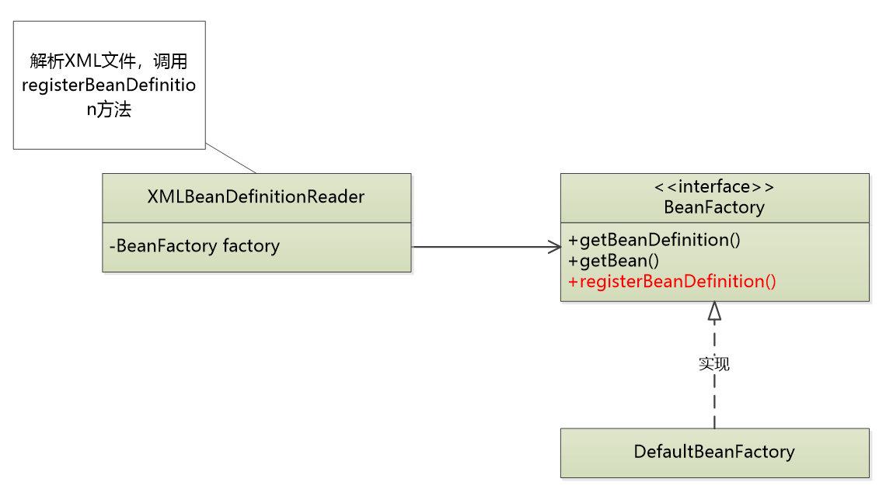
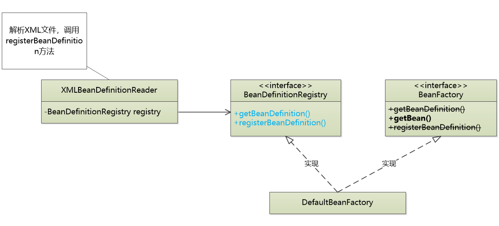

# Basic BeanFactory（下）   

D：看一下这个类，``loadBeanDefinition()``方法有什么问题呢？  

```java
public class DefaultBeanFactory implements BeanFactory {
	
	public static final String ID_ATTRIBUTE = "id";
	public static final String CLASS_ATTRIBUTE = "class";
	private final Map<String,BeanDefinition> beanDefinitionMap = new ConcurrentHashMap();
	
	/**
	 * 构造文件
	 * @param configFile
	 */
	public DefaultBeanFactory(String configFile) {
		loadBeanDefinition(configFile);
	}
	/**
	 * 加载xml
	 * @param configFile
	 */
	private void loadBeanDefinition(String configFile) {
		InputStream is = null;
		try {
			ClassLoader cl = ClassUtils.getDefaultClassLoader();
			is = cl.getResourceAsStream(configFile); //读取配置文件
			SAXReader reader = new SAXReader();  //dom4j解析xml文件
			Document doc = reader.read(is);   //读取成Document文件
			
			Element root = doc.getRootElement();  //<beans>
			Iterator<Element> iter = root.elementIterator();
			while(iter.hasNext()){
				Element ele = (Element)iter.next();
				String id = ele.attributeValue(ID_ATTRIBUTE);
				String beanClassName = ele.attributeValue(CLASS_ATTRIBUTE);
				BeanDefinition bd = new GenericBeanDefinition(id,beanClassName);
				this.beanDefinitionMap.put(id,bd);
			}
		} catch (Exception e) {
			//e.printStackTrace();
			throw new BeanDefinitionStoreException("IOException parsing XML document", e);
		}finally {
			if(is != null){
				try {
					is.close();
				} catch (Exception e) {
					e.printStackTrace();
				}
			}
		}
	}

	public BeanDefinition getBeanDefinition(String beanID) {
		return this.beanDefinitionMap.get(beanID);
	}
	/**
	 * 获取bean对象
	 */
	public Object getBean(String beanID) {
		BeanDefinition bd = this.getBeanDefinition(beanID);  //获取BeanDefinition对象
		if(bd == null){
			throw new BeanCreationException("Error creating does not exist");
			//return null;
		}
		ClassLoader cl = ClassUtils.getDefaultClassLoader();
		String beanClassName = bd.getBeanClassName();
		try {
			Class<?> clz = cl.loadClass(beanClassName);
			return clz.newInstance();   //创建对象
		}
		catch (Exception e) {
			throw new BeanCreationException("Error creating does not exist");
		}
		/*catch (ClassNotFoundException e) {
			e.printStackTrace();
		}catch (InstantiationException e) {
			e.printStackTrace();
		}catch (IllegalAccessException e) {
			e.printStackTrace();
		}*/
		
	}

}
```

M：会有什么不妥的地方吗？

Z：``loadBeanDefinition()``做的是xml文件的读取，而``getBean()``做的是对象的获取。违背了SRP单一职责原则。

M：什么是单一职责原则？怎么理解？

Z：比如，一根尺子，既可以用来打学生手板，也可以用来丈量布匹。而在单一职责原理下，尺子的两个功能就是引起这个类变化的两个原因，就应该写成两个类。   

M：根据单一职责，loadBeanDefinition提取成XMLBeanDefinitionReader类，然后通过``registerBeanDefinition()``方法进行调用。

    

Z：但是这样子的类图还有缺点就是,``registerBeanDefinition()``方法是一个会对生成的对象进行影响的方法，太敏感了，不应该直接向客户暴露。可以的话，我们要尽量向客户暴露最少量接口。所以要做接口拆分：

  

把两个无关的方法提取到BeanDefinitionRefistry类中，DefaultBeanFactory再同时对两个接口进行实现。

M：简单来说，就是loading

Z：第一步，我们要做的是测试案例。由于之前已经有测试案例，所以在其上面进行修改：

```java
	@Test
	public void testGetBean() {
		//读取配置文件     面向接口编程
		DefaultBeanFactory factory = new DefaultBeanFactory();
		XmlBeanDefinitionReader reader = new XmlBeanDefinitionReader(factory);
		reader.loadBeanDefinitions("petstore-v1.xml");
		
//		BeanFactory factory = new DefaultBeanFactory("petstore-v1.xml");
		BeanDefinition bd = factory.getBeanDefinition("petStore");
		//校验配置文件属性
		assertEquals("org.litespring.service.v1.PetStoreService", bd.getBeanClassName());
		//实例化对象
		PetStoreService petStore = (PetStoreService)factory.getBean("petStore");
		//判断对象成功实例化否
		assertNotNull(petStore);
	}
```

M：``BeanFactory factory = new DefaultBeanFactory("petstore-v1.xml");``这个方法是怎么修改为以下代码的呢？

```java
		//读取配置文件     面向接口编程
		DefaultBeanFactory factory = new DefaultBeanFactory();
		XmlBeanDefinitionReader reader = new XmlBeanDefinitionReader(factory);
		reader.loadBeanDefinitions("petstore-v1.xml");
```

Z：因为DefaultBeanFactory类是最底层的类，实现它之后将对象传到上一层的类中

````java
		DefaultBeanFactory factory = new DefaultBeanFactory();
		XmlBeanDefinitionReader reader = new XmlBeanDefinitionReader(factory);
````

因为``loadBeanDefinitions()``方法在XmlBeanDefinitionReader类中，所以需要在该类实例化的对象中调用解析xml的方法``reader.loadBeanDefinitions("petstore-v1.xml");``      

M：


8min  loading


