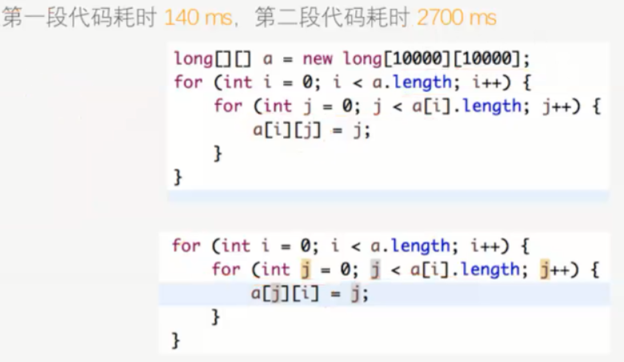
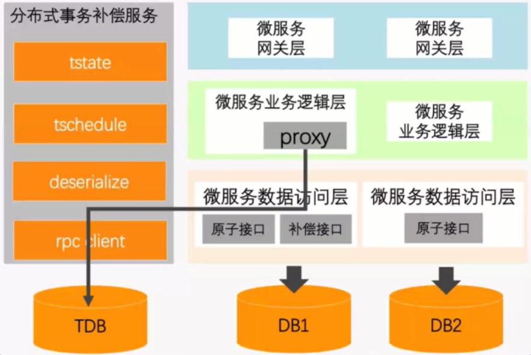
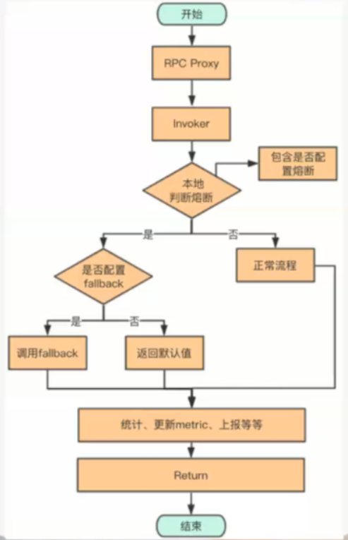

# 架构课

## 互联网总体架构设计（[架构演进](component/framework-evolution.md)）

本章介绍了架构是怎么从**单体架构** - **水平分层架构** - **垂直拆分架构SOA** - **垂直水平拆分架构** - **服务网格架构** 逐步演进的，都是为了解决说明问题。

## 互联网核心技术实践

4-1 32min

### 1.高可用设计手段

高可用的评估方式：影响请求量/总的请求量（不同时间段的请求量不同）

热开光：更新服务时可以添加热开关按钮，作为配置控制是否接收请求。

### 2.高并发设计手段

高并发的评估方式：关注吞吐量、响应延迟。

#### 优化手段：

- 空间换时间：能用缓存就用缓存（时效性高的数据不适用），复用计算结果，因为CPU时间 贵于 内存容量

- 时间换空间：1.网络传输，用Http的gzip压缩算法压缩数据，换取传输空间 2.App请求，用版本号判断，仅下载需要更新的数据（值得的交换）

  例2：qq好友列表，缓存在本地，判断数据版本号更新了，就往数据库更新一份。

- 找到系统瓶颈：优先优化高QPS的接口，没有数据依赖的逻辑能否并行执行

- 循环遍历是否合理：不要循环调RPC接口、查分布式缓存、执行SQL

  先批量接口组装好数据，再循环处理

- 避免生成过多无效对象，能复用就复用

- ArrayList，HashMap初始容量是否合理

- String，StringBuilder（频繁拼接）的选用

- 全局初始化数据，饿汉模式，先初始化好数据。（类似于商场的静态类目）

- 建表尽量用小的数据结构，更加轻便

- 避免使用``select *`` ,可以节省数据IO、内存、CPU、网络传输

- 增量查询：数据量大，做增量查询，与之前计算结果合并

- NOT NULL：字段使用not null类型，降低数据库的开销

- Sql筛选：尽可能地添加筛选条件，可以让数据库更好地利用索引。（查询数据量少于30%才会做索引）

局部性原理：

 - CPU会把调用到的数据附近的数据缓存到缓存区(L1 > L2 > L3 > 内存)中，如果调用方式跟物理存储方式不同，调用效率也会降低。

        

- 异步执行：分析主次流程，将次要流程拆分出来异步执行，可以用到消息队列，和核心流程解耦。

#### 秒杀系统

在瞬间秒杀中，99%的请求时无效的（只有1%的人买得到商品）。

秒杀系统的设计（将不符合要求的用户层层过滤掉）：

1. 静态文件放在CDN

2. 非实时动态数据（商品标题，商品描述，图片URL，秒杀活动信息等）缓存到访问链路比较靠近用户的位置

3. 过滤掉不符合秒杀活动的用户（例如库存量，查询后存在Cache中，用户请求前先看符不符合缓存）

4. 过滤到数据库的流量很少（10000人请求可能只有100人访问数据库），通过事务保证扣减库存准确性

#### feed系统

feed系统中，有热点数据、高访问、读写比例100:1

feed系统设计：

1. 读多写少：热点数据缓存到调用链路靠近用户的地方
2. 多级缓存：大V用户单独缓存
3. 消息发布：采用push方式，直接将用户信息发送到MQ。活跃用户先推（维护活跃用户列表），非活跃慢慢推。
4. Feed存储：根据不同的业务选择不同数据库，涉不涉及关系型数据库。

### 3.服务无状态化设计

无状态：冗余部署多个模块完全对等。主要就是处理session存储问。

#### session存储在网关

这样网关为有状态化、单点。

如果要做负载均衡，可以用多个网关，每个网关存储所有的session。但是这样就需要多个网关之间进行session同步，而且同步之间有时间差。

所以可以使用粘性会话，一个用户访问一个网关，将永远访问该网关。但是这样又引入单点的问题。

#### session存储在客户端

为了让网关无状态化，将session存到客户端。存在被用户清除，还有传输带session占流量问题。

#### session单独存储

将session与网关分离，存储到redis上。分片（防止单点）后做主从（备用机制）。但是这样就需要处理网关知道session存在哪一片上。

codis就是在session集群上加一层寻找session片的程序。但是存在添加session集群，所有数据需要进行迁移的问题。（本来是计算%10，10台机子分配。现在要15台，就是通过计算%15，所有的session集群都需要做调整。）

这个问题不做处理，因为丢失session只是用户需要重新登陆，所以在低幅期做session集群调整（防止大量用户登陆，服务器奔溃）。

### 4.服务负载均衡设计   

#### zookeeper发现

负载均衡可以用zookeeper做注册中心，将业务逻辑注册到zk上。网关层和业务逻辑层之间是RPC通讯。服务监测：每个业务逻辑服务有zk客户端，zookeeper会检测zk客户端的心跳情况，两次即剔除服务（关闭长连接）。但是如果服务假死，心跳还在，服务就没有剔除了。

#### 网关发现

可以用网关检查服务是否正常，网关将返回的结果存到MQ中，新建thread扫描队列中错误的比例，如果超时量>30%，说明服务有问题。

#### 熔断机制

熔断可以用Hystrix，但是Hystrix太重了，也可以手动实现：

1. jstack 2 次  2次打印进程stack信息，可以有对照（死循环的时候进程stack信息相同）
2. kill 进程（容器的话，kill pod）
3. sleep 6s  防止启动太快，zookeeper不知道服务被重启过
4. start服务

（2019.6.30整理）

### 5.服务幂等设计

会对数据发生改变的，就需要做幂等，像部分删、改、插（应用于 转账，交易）。读请求不会修改数据无需幂等。

数学表达方式：f(x) = f(f(x))，执行多次和执行一次相同。

（细节后续再做研究）

### 6.分布式锁设计

分布式锁的定义：请求串行化，表现为互斥锁。

因为Redis是单线程的，可以用Redis做分布式锁，实现方式如下：

1. Redis  Setnx(SET if Not exist)：SETNX KEY_NAME VALUE Expire Time当key不存在时，为key设置值。

   极端情况问题：T1和T2两个线程获取锁，如果Redis还没来得修改状态时挂了，T1和T2将会获取到两次锁。所以Redis分布式锁不适用于交易场景。

分布式锁时[CP模型]()，Redis是[AP模型]()，所以用Redis解决不了分布式锁问题。zk和etcd是CP模型，基于效率和热度考虑，分布式选择etcd。

[Etcd实现分布式锁]()  

分布式锁的应用：

- 防止重复下单，解决业务幂等问题
- 用户支付商品，而同时商家也在改价，状态的修改需要做成串行。

### 7.分布式事务设计

因为分布式系统的存在，一系列事务动作可能涉及到不同的数据表。为了让事务正常执行，所以需要设计分布式事务。

解决分布式事务两套方案：刚性分布式事务、柔性分布式事务

#### 刚性分布式事务

保证强一致性

那所有需要操作的数据库锁住，逐个执行到结束，机子挂了会进行重试。（耗时长，不适合长事务）

#### 柔性分布式事务

保证最终一致性

可以用TCC模型和Sagas模型

- TCC模型：Try - Confirm - Cancel，实例如下

  |         | 汇款服务                                                     | 收款服务                                                     |
  | ------- | ------------------------------------------------------------ | ------------------------------------------------------------ |
  | Try     | 1.检查A账号是否符合汇款条件  2.扣除500元，状态为转账中  3.将A转账B事件写入消息或日志中 | 检查B账号是否符合收款条件                                    |
  | Confirm | 不做任何操作                                                 | 1.读取日志或消息，B账号增加500元  2.从日志或消息中释放扣减资源 |
  | Cancel  | 1.A账户增加500  2.从日志或消息中释放扣减资源                 | 不做任何操作                                                 |

  对业务侵入比较大，用得少

- Sagas模型  

  把一个分布式事务分为多个本地事务，每个本地事务有相应的执行模块和补偿模块。补偿有两种恢复方式：向前恢复（重试事务，直到成功） & 向后恢复（补偿已完成的事务，进行恢复） 

#### 同步场景分布式事务设计

业务逻辑层引入proxy，将事务记录（id，状态，时间戳等）存入到TDB。如果某个步骤出错，则会将失败的状态存入到TDB中。补偿服务会定时扫描TDB，调用补偿接口对执行过的步骤进行补偿回滚。

（具体内容再做研究）

### 8.服务降级设计

降级手段（流量抛弃）：

- 拒绝部分老请求：请求已经超时了，再返回也没有意义。根据请求在队列里停留时间决定是否拒绝请求。
- 优先请求方式：非核心请求直接丢掉。
- 随机拒绝请求

### 9.服务限流/熔断设计

熔断器Hystrix：客户端需要引入jar包，需要重写Hystrix command，属于非平台化的

平台化思路：RPC Client fallback服务管理平台

  

### 10.服务灰度发布设计   

6-2  1:28

### 11.服务全链路压测设计

### 12.千亿级真实案例实战

 