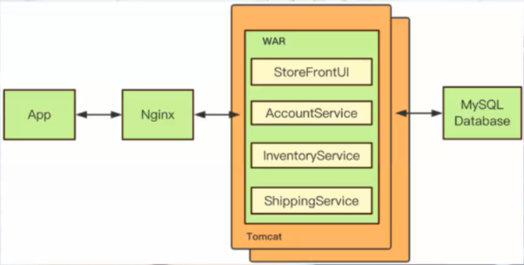
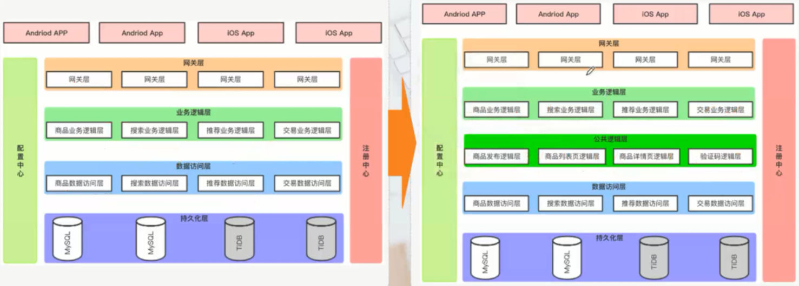
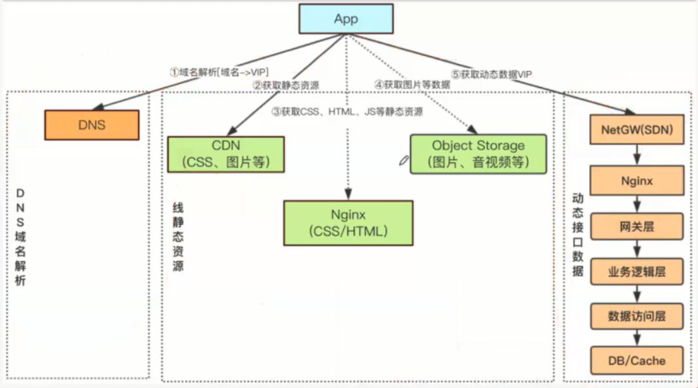
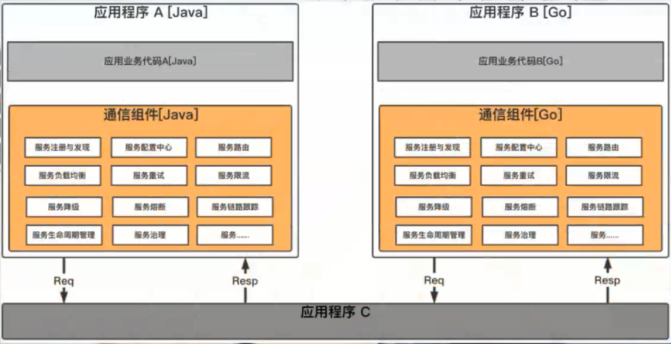
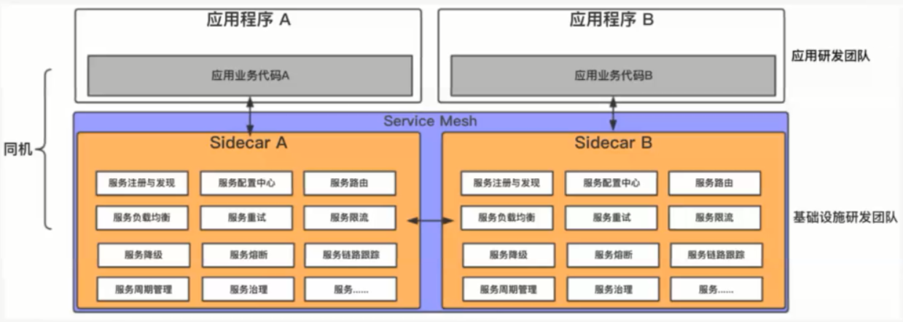

#架构演进

当数据库性能不足时，可以进行横向分表与纵向分表进行拆分。同理，项目也可以进行拆分。

由原先的**单体架构**(适用于创业公司，开发人员少，性能苛刻)，可以做以下拆分：

   

## 1.水平分层架构

针对功能进行拆分，将一个进程拆为多个进程。

  

#### 网关

网关不做展示逻辑，因为前后端分离，展示逻辑在App做。（网关给的时间格式是：151638418，而App给转化为要展示的时间格式）

网关层的功能：

- 请求鉴权：发布、登陆鉴权（通过cookie）

- 数据完整性检查：数据包 = 定长[Header]() + 变长Body（JSON串），保证传过来的数据是否齐全。

  定长Header = uid + sessionId + cmd(请求命名号) + bodyline

- 协议转换：从http转化为传输协议[TCP]()，数据协议。(提升传输效率)

  将数据格式从JSON转化为HashMap<String, Object>  ,然后用[Pb]()对HashMap做序列化（二进制 + 压缩）。

- 路由转发：根据CMD转发到不同业务逻辑层

- 服务治理：限流、降级、熔断等

网关Spring Cloud Gateway的IO模型是[Netty]()，而Netty是基于[NIO]()（New IO）模型   

#### 业务逻辑层

业务逻辑层之间是不相互调用的，如果某个业务用到另外的业务信息，直接调用该业务的数据访问层。

用feign调用其他服务，可能会产生循环调用的情况。（类似于死锁）

当时当多个业务调用同一业务的数据访问层，就会产生重复代码。所以要将重复代码提取出来，下沉为**公用逻辑层**。公用逻辑层一定不能反向向上调用。

  

#### 数据访问层

拆分数据访问层，在数据库做调整的时候，不会对业务层产生影响。

数据访问层的功能如下：

- CRUD

- ORM：将数据从PB协议转化为SQL协议，用的是Mybatis3

- Sharding（分库分表）：用Sharding-JDBC。PARTITIONS KEY 只能选一个

  替代方案：分表（多张表）会带来查询问题，尽量不分表。将分表交给DB处理，数据库发展阶段：

  1. RDBMS：单机关系型数据库。oracle，mysql
  2. NOSQL：分布式非关系型数据库，解决了分库分表，但一致性不好。MongoDB（新版本支持事务），Redis
  3. NEW SQL：既注重事务，又解决分库分表。TiDB（基于Mysql协议）

- 屏蔽底层存储差异性：用Mysql/MongoDB/Redis对业务逻辑没影响

#### 异步架构   

同步架构指的就是没有返回就不会执行下去。在同步架构分层中插入MQ（MQ是顺序写，而DB是随机写，所以MQ比较快。），可以增大吞吐量，变成异步架构。

MQ插入位置为网关与业务之间：

  

网关会过滤垃圾数据，插入在网关之前会存入很多垃圾数据。

并不是所有的写请求都适合用异步架构，如果是实时性比较高的场景就不适合用异步（充值）。

#### 分层适度

分层不宜过多，过多会产生：请求路径过长、响应延迟变高、问题复杂化。过少则成单体架构。适宜是4~5层

- 网关层
- （异步）异步消息队列层
- 业务逻辑层
- 数据访问层
- 数据存储层

#### APP层

APP层结构如下：

   

虚线部分表示App并非直接从Nginx、Object Storage中获取资源。而是先从CDN中请求资源，CDN中不存在该资源，CDN才从Nginx、Object Storage中请求资源。最终的资源来源都是CDN。

Object Storage一般是存储在fastdfs中，当资源比较多时则可采用ceph。  

## 2.垂直拆分架构-SOA

根据业务进行拆分，通过ESB（企业服务总线）交互。每个业务还是一个单体，对ESB严重依赖。

## 3.垂直水平拆分架构-微服务

微服务架构的优势：

- 快速迭代，持续交付
- 性能变高（横向扩展）

微服务劣势：

- 响应延迟变高（增加请求消耗）

## 4.服务网格架构  

微服务中，每个应用服务需要关注**通讯组件**。通讯组建有以下问题：

- 升级困难，要逐个替换jar包
- 多种编程语言对应多个语言的通讯组件

  

Service Mesh则是为了实现业务和通讯组件剥离，将通讯组件单独管理。

  

应用程序只和自己的Sidecar进行通讯（而不同的Sidecar则相互之间进行通讯），为了解决通讯问题，Sidecar与应用程序必须部署在同个host/pod同机下。

应用程序通过Pb & [TCP]()同它的Sidecar进行通讯（因为Pb和TCP是通用的，所以不同应用程序的语言可以不同）。

不同机子上的Sidecar则通过注册到注册中心进行通讯。

